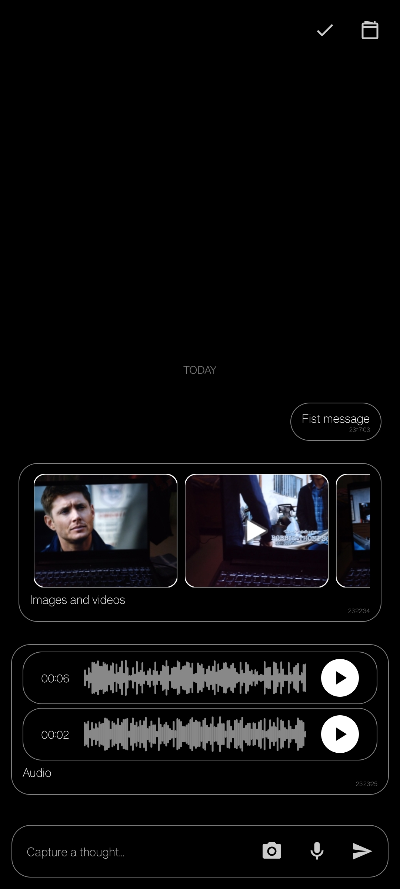
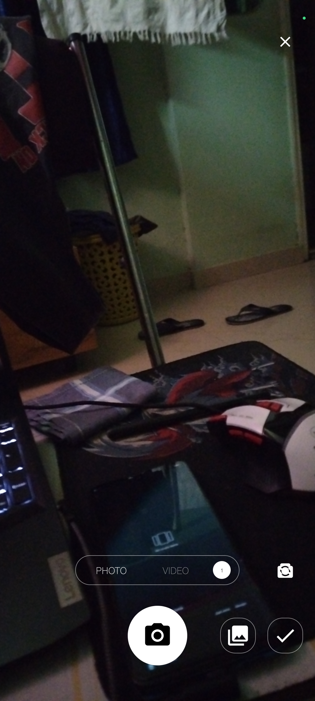
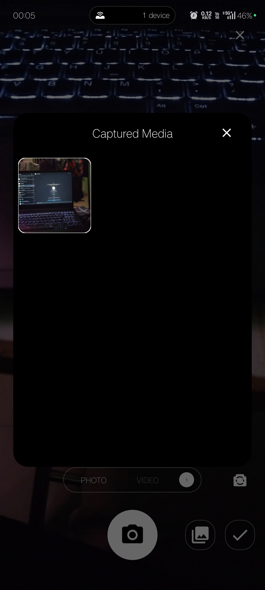

# Crimson Launcher (codename: crimson)

Crimson Launcher is a forked version of Olauncher with integrated daily task management. This fork was created to gamify your days and keep Daily, Timed, and Timeless tasks visible directly on the home screen. Other task apps were too noisy or easy to forget to open. With Olauncher's simplicity as the foundation, todos were integrated directly into the launcher to keep remaining tasks always in sight.

## Key Features

- **Home-pinned checklist** with Daily, Timed, and Timeless tasks
- **Hardware-level screen time tracking** (includes screen-on even when locked)
- **Unlock count tracking** - know how many times you unlocked your phone
- **Configurable daily reset time** - choose when your tasks reset (default: midnight)
- **Boiler (Template) system** - save and swap sets of daily tasks quickly
- **Hardcore mode** - blocks the app drawer until all today's tasks are completed
- **Progress logging** - JSONL format with selectable storage folder
- **Backup & Restore** - export/import all tasks, templates, and settings to JSON
- **App management** - hide, rename, or uninstall apps directly from the drawer
- **Chat/Notes system** - send text, photos, videos, and voice messages with date-organized history
- **In-app Camera** - capture photos and videos directly from the launcher with CameraX, flip camera, and swipe to switch modes
- **Temp media management** - captured media sits in a temp gallery until you send it; review, select, or discard before finalizing
- **Audio recording** - record voice messages with a live waveform visualizer
- **Media preview** - swipeable full-screen viewer with pinch-to-zoom for images and video playback with seek controls
- **Offline-first** - fully functional without internet; all data stays local

## Screenshots

| Home Page | Right Page | Settings Page |
|-----------|------------|---------------|
|  |  |  |

| Task Management Page | App Drawer |
|----------------------|------------|
|  |  |

| Chat Page | Camera UI | Temp Media Gallery |
|-----------|-----------|-------------------|
|  |  |  |

---

## Navigation

Crimson Launcher uses a circular swipe navigation between fragments:

```
Home → Chat → Task Management → Settings → Right Page → Home
                     ↺ (and reverse)
```

Additional navigation paths from Camera:

```
Chat → Camera (via button)
Camera → Chat (back)
```

### Gesture Navigation

| Gesture | Action |
|---------|--------|
| **Swipe Left** (from Home) | Go to Right Page (Upcoming & Completed tasks) |
| **Swipe Right** (from Home) | Go to Chat Page (notes & messaging) |
| **Swipe Left** (from Right Page) | Go to Settings |
| **Swipe Left** (from Settings) | Go to Task Management Page |
| **Swipe Right** (from Task Management) | Go to Chat |
| **Swipe Right** (from Chat) | Go to Task Management Page |
| **Swipe Left** (from Chat) | Go to Home |
| **Swipe Right** (from Settings) | Go to Right Page |
| **Swipe Up** (from bottom of today's tasks) | Open App Drawer |
| **Swipe Down** (from top of today's tasks) | Open Notification Panel or Search (based on settings) |

---

## Fragment Details

### 1. Home Page

The Home Page is the main dashboard displaying your daily overview and remaining tasks.


#### Features

**Screen Time & Unlock Count**
- Shows total screen-on time (including when phone is locked)
- Displays unlock count - how many times the phone was unlocked
- Data is fetched at the hardware level using Android's UsageStatsManager
- Format: `Xh Ym   [N unlocks]`

**Clock & Date**
- Displays current time and today's date
- Can be toggled on/off from Settings

**Today's Task List**
- Shows all tasks due today: Daily, Timed, and Timeless tasks
- Tap the checkbox to mark complete/incomplete
- Completed tasks show a strikethrough

#### Editing Tasks

Long-press on any task in the home page to access edit/delete options:


The edit section allows you to modify task details:


---

### 2. Right Page

The Right Page displays timed and timeless tasks that need to be done, along with completed tasks.


#### Sections

**Upcoming Tasks**
- Shows only Timed and Timeless tasks (daily tasks are managed separately)
- Tasks are sorted by date/time
- Tap checkbox to mark complete

**Completed Tasks**
- Shows completed Timed and Timeless tasks
- Keeps your view clean by separating upcoming from done

After completing some tasks, the page looks like:


#### Managing Completed Tasks

Long-press on a completed task to delete it:


---

### 3. Task Management Page

The Task Management Page (accessible by swiping right from Home) handles daily task creation and boiler/template management.


#### Upper Section: Task Creation

This section allows you to create new Daily tasks:

| Field | Description |
|-------|-------------|
| **Task Input** | Enter the task description |
| **Weekday Selector** | Select which days the task repeats |
| **From Date** | Start date for the task |
| **To Date** | End date for the task (optional) |
| **From Time** | Start time for the task |
| **To Time** | End time for the task |

**Long-press** on any date/time button to reset it.

#### Action Buttons

| Button | Function |
|--------|----------|
| **Boiler** | Opens the template section to save/load task sets |
| **Save** | Creates the task with selected settings |
| **All** | Toggles all weekdays on/off |

#### Boiler (Template) Section

Press the Boiler button to access saved task templates:


- Save current task set as a template for quick switching
- Templates don't affect Timed or Timeless tasks

#### Lower Section: Task List

Shows all Daily tasks for the currently active boiler. 

**Tap** a task to edit it.

**Long-press** for options:


- **Copy**: Copies the task to the upper section where you can modify it and create a new task with similar settings
- **Delete**: Removes the task

---

### 4. App Drawer

The App Drawer displays all installed applications on your device.


#### Features

- Lists all installed apps alphabetically or by recent use
- Search functionality - type to filter apps
- Auto-show keyboard option (configurable in Settings)

#### Long-press Options

Long-press any app to access:

| Option | Description |
|--------|-------------|
| **Uninstall** | Remove the app from your device |
| **Rename** | Change the app's display name in the drawer |
| **Hide** | Hide the app from the drawer (accessible via Settings) |
| **Info** | View app details (permissions, version, etc.) |
| **Close** | Force stop the app if it's running |

---

### 5. Settings Page

The Settings Page contains all customization options for Crimson Launcher.


---

#### Top Section

| Setting | Description |
|---------|-------------|
| **Crimson Logo** | Tap to access hidden apps list |
| **Change Default Launcher** | Opens system picker to set default home launcher |

---

#### Home Section

| Setting | Description |
|---------|-------------|
| **Show Date Time** | Toggle clock and date display on Home Page |
| **Screen Time** | Toggle screen time and unlock count display on Home Page |

---

#### Appearance Section

| Setting | Description |
|---------|-------------|
| **Auto Show Keyboard** | Automatically show keyboard when App Drawer opens |
| **Status Bar on Top** | Keep status bar visible at the top of the screen |
| **Text Size** | Adjust the font size across the launcher (slider control) |
| **App Alignment** | Choose left or right alignment for clock/date and app drawer items |

---

#### Gestures Section

| Setting | Description |
|---------|-------------|
| **Swipe Down for** | Configure swipe down gesture: **Notification Panel** or **Search** |

---

#### Other Section

| Setting | Description |
|---------|-------------|
| **Hardcore Mode** | When enabled, blocks App Drawer until all today's tasks are completed |
| **Daily Reset Time** | Set the time when daily tasks reset (default: 00:00 midnight) |
| **Backup Data** | Export all settings, tasks, and templates to a JSON file (user selects save location) |
| **Restore Data** | Import from a previously saved JSON backup file. **Note:** Current tasks will be replaced |
| **Clean Slate** | Delete all boilers and tasks - a fresh start |

---

#### Chat Settings Section

| Setting | Description |
|---------|-------------|
| **Chat Storage Folder** | Select where chat messages and media are saved (SAF folder picker) |
| **Clear Chat** | Delete all chat messages and media permanently |

---

#### Progress Logs Section

| Setting | Description |
|---------|-------------|
| **Logging Enabled** | Toggle to enable/disable event logging (default: off) |
| **Log Storage Folder** | Select where log files are saved |
| **View Logs** | Browse and inspect event logs |

---

### 6. Chat Page

The Chat Page is a notes and messaging system integrated into the launcher. Access it by swiping right from Home.


#### Features

**Message Types**
- **Text messages** - type and send notes with timestamps
- **Photo/Video messages** - attach media captured from the in-app camera or picked from gallery
- **Voice messages** - record audio with a live waveform visualizer, playback with seek controls

**Message Management**
- Messages are grouped by date with headers (Today, Yesterday, date)
- Long-press a message to reveal actions: Edit, Copy, Delete
- **Multi-select mode** - tap the checkmark icon to enter selection mode, then long-press multiple messages to batch delete
- **Calendar jump** - tap the calendar icon to jump to any date with messages
- **Keyboard-aware** - input field moves above the keyboard automatically

**Input Controls**

| Button | Function |
|--------|----------|
| **Camera** | Opens the in-app camera to capture photo/video |
| **Microphone** | Records a voice message (requires mic permission) |
| **Send** | Sends the message with any attached media |
| **Calendar** | Jump to messages from a specific date |
| **Select Mode** | Toggle multi-select for batch operations |

#### Swipe Navigation

- **Swipe Left** → Go to Home
- **Swipe Right** → Go to Task Management Page

---

### 7. Camera

The Camera fragment provides a full-featured in-app camera for capturing photos and videos. Access it from the Chat Page by tapping the camera button.


#### Features

**Capture Modes**
- **Photo mode** - capture high-quality still images using CameraX
- **Video mode** - record video with audio; swipe left/right to switch modes
- **Flip camera** - toggle between front and rear cameras

**Temp Media Workflow**
- Captured photos and videos are stored as **temporary media**
- A badge counter shows the number of captured items
- Tap the gallery button to review, select, or discard items before sending
- Tap **Select/Done** to return to Chat with the chosen media attachments

**Recording UI**
- Video recording shows a live timer (HH:MM:SS:mmm)
- Red indicator when actively recording
- Tap the capture button again to stop recording

**Existing Temp Media**
- On opening the camera, any unsent temp media from the current day is automatically loaded, so you never lose in-progress captures.

---

#### Temp Media Gallery

When you have captured media (or tap the gallery button with existing captures), a grid gallery dialog opens:


- Displays all captured images, videos, and audio in a 3-column grid
- **Tap** a visual item (image/video) to preview it in full-screen
- **Long-press** any item to toggle selection
- **Select multiple items** and tap **Confirm** to send them all at once
- Audio items always require selection (tap to select)

---

#### Media Preview (Full-screen Viewer)

Tapping an image or video thumbnail opens a full-screen immersive viewer:

- **Swipe left/right** to browse through all media attachments
- **Pinch-to-zoom** (up to 5x) with pan support
- **Double-tap** to zoom in/out
- **Video playback** with play/pause, seek bar, and time display
- **Memory-efficient** - loads preview thumbnails first, then high-quality images with LRU caching
- Tap outside the media or the close button to dismiss

---

## Installation

### Requirements

1. **Android Device** (Android 8.0+ recommended)
2. **Usage Access Permission** - Required for screen time and unlock tracking
3. **No Internet Required** - Fully functional offline

### Installation Steps

1. Download the latest APK from the [Releases](https://github.com/crimson-genesis/Olauncher/releases) page
2. Transfer the APK to your device
3. **For Google/Pixel phones**: 
   - Go to Settings → Security → Disable "Verify apps over USB" or enable "Install unknown apps"
   - This allows installation of apps outside the Play Store
4. Open the APK file to install
5. Set Crimson Launcher as your default home launcher when prompted

### Permissions

- **Usage Access**: For screen time and unlock count tracking
- **Storage Access**: For backup/restore and log folder selection (uses SAF - no storage permission needed on Android 10+)
- **Camera**: For in-app photo and video capture
- **Microphone**: For video audio recording and voice messages

---

## Technical Details

### Data Storage

- **Tasks & Templates**: Room Database (SQLite)
- **Settings**: SharedPreferences
- **Backups**: ZIP archive (JSON + assets, user-selected location via Storage Access Framework)
- **Logs**: JSONL files in user-selected folder
- **Chat Messages**: JSON files organized by date in user-selectable storage (SAF) or internal storage
- **Media (photos, videos, audio)**: Files organized by date/type in user-selectable storage (SAF) or internal storage; temp media auto-cleaned on day reset

### Task Types

| Type | Behavior |
|------|----------|
| **Daily** | Repeats on selected weekdays; managed in Task Management Page |
| **Timed** | One-time task with specific date and time; shown in Right Page |
| **Timeless** | One-time task without specific time; shown in Right Page |

### Daily Reset

- By default, tasks reset at midnight (00:00)
- Configurable via "Daily Reset Time" in Settings
- Resets completed status for Daily tasks

---

## License

- **GPLv3** - See [LICENSE](./LICENSE) file
- **Forked from**: [Olauncher](https://github.com/tanujnotes/Olauncher) © 2020-2026 Tanuj (tanujnotes)
- **Current Maintainer**: © 2026 Yuvraj Mahilange (crimson-genesis)

### Design Assistance (pre-v1.2)

- [notarkhit](https://github.com/notarkhit)
- [AbraraliS](https://github.com/AbraraliS)
- [AJAjith0503](https://github.com/AJAjith0503)

Everything after v1.2 has been built and maintained solely by [crimson-genesis](https://github.com/crimson-genesis).

---

## Release History

- **Crimson v1.7** – Added full Chat/Notes system with text, photo, video, and voice messages. Integrated in-app camera with CameraX (photo + video capture, flip camera, swipe mode switch). Temp media workflow with grid gallery and full-screen media preview (pinch-to-zoom, video playback). Audio recording with waveform visualizer. Multi-select batch message operations and calendar date jump. The APK is now even smaller and faster than before thanks to ProGuard/R8 minification, resource shrinking, and aggressive bytecode optimization — delivering a leaner, snappier experience.
- **Crimson v1.6** – Held the lockscreen todo notification in place (non-dismissible foreground service), refreshes the home checklist on every unlock, and syncs notification visibility with the current task/overdue ordering.
- **Crimson v1.5** – Hardened boiler/template isolation, ensured restores reselect the right template, deduplicated completed rows, and triggered `refreshTodayList()` automatically after resetting at the configured time.
- **Crimson v1.4** – Refined template isolation, restore hygiene, and the backup/log pipeline so today/todo feeds filter by originTemplateId and imported data immediately loads.
- **Crimson v1.3** – Added overnight task support, task copy + boiler management stability fixes, and refreshed documentation; also removed local Gradle cache artifacts.
- **Crimson v1.2** – Improved task ranges/visibility plus signing/build workflow updates.
- **Crimson v1.1** – Initial Crimson Launcher release on top of Olauncher with integrated todo management.

---

## Support

For issues, feature requests, or contributions, please visit the [GitHub Repository](https://github.com/crimson-genesis/Olauncher).
